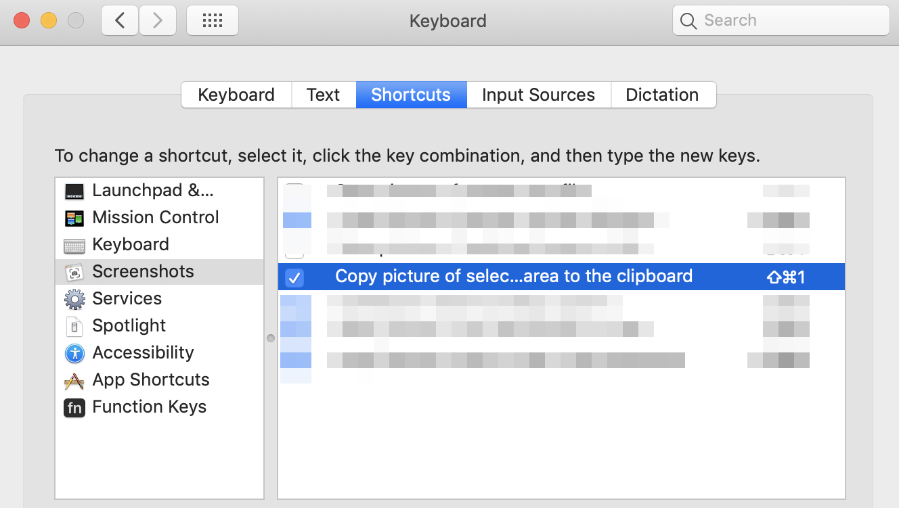
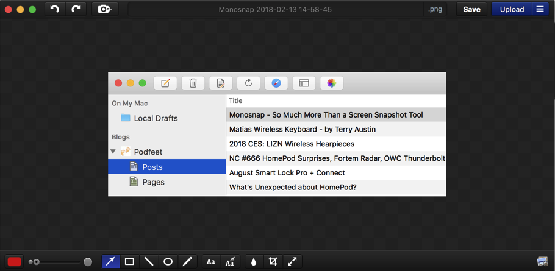

One thing I have learned in since I started working remotely about five years ago is that communicating clearly is very important.  Remote working has many benefits but inherently better communication is not one of them.

Context can be easily lost.  The other person may be in a different timezone.  Cultural jargon you understand can be lost with other cultures.  There is a time delay when using asynchronous means of communicating (chat, comments).

There are things I've learned to help overcome these challenges.  Communicating clearly, with concrete examples is one of them.  Making sure to "spell things out" and not assume my reader will know insider jargon or acronyms.  But, one of my favorite things to do is communicate with screenshots, annotations, animated GIFs and videos **often**.

I've spent quite awhile finding tools I like and setting things up to make me productive.  I'd like to share my setup in hopes it spurs some ideas in others.

## Tools

- [macOS screenshots](https://support.apple.com/en-us/HT201361) - The built in tool to "Copy picture of selected area to the clipboard" (mapped to Command + Control + Shift + 4 by default) is easy, fast, and a good tool for quickly selecting an area of my screen.  I use it when I don't need to annotate and I can copy/paste from clipboard to my target app.  
- [Monosnap](https://monosnap.com/) - When adding some text, drawing a box, or pointing with an arrow will help communicate something more clearly, I use Monosnap.  Also, I like using Monosnap for making videos since it supports easy sharing.  
- [Gifox](https://gifox.io/) - This is a simple tool for record animated GIFs and has drag/drop support which makes it suitable for quick sharing on GitHub and Slack.  

## Keyboard Shortcuts

I have keyboard shortcuts setup for these tools, in a progressive order.  This makes using this quick and easy to remember.

- Screenshot: Command + Shift + 1 (macOS Copy picture of selected area to the clipboard)
- Annotated Screenshot: Command + Shift + 2 (Monosnap)
- Animated GIF: Command + Shift + 3 (Gifox)
- Video: Command + Shift + 4 (Monosnap)

## Sharing

If the app I am sharing to supports copy/paste or drag/drop I will use that.  For example, I do this when sharing screenshots and animated GIFs to Slack or GitHub.  This allows my audience to see the visual quickly without having to click a link.

For all other cases (including email), I will upload the media to Google Drive and share the link.  Monosnap and Gifox both support sharing to Google Drive.
