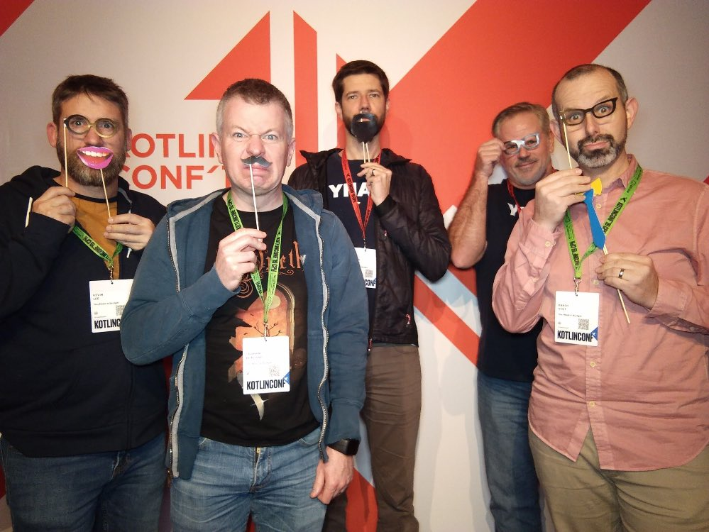

This week I had the opportunity to attend [KotlinConf 2019 in Copenhagen, Denmark](https://kotlinconf.com/) with 4 other fellow colleagues at YNAB.  It was a great time of learning new things, meeting new people, seeing the city of Copenhagen, and spending time with my fellow coworkers and friends.

Kotlin is not a language I use (yet) but at YNAB we are evaluating using its [multiplatform capability](https://kotlinlang.org/docs/reference/multiplatform.html) to enable writing code in Kotlin that can be compiled down to JVM (for Andriod), Native (for iOS), and JavaScript (for Web).  The prospect of us being able to share code in this way is compelling so we want to learn more.

I walked away admiring the Kotlin language, impressed with its community, and hopeful for the future in regards to multiplatform support and features.

## Sessions I Attended

### Day 1

- Go multiplatform with Kotlin Workshop - Salomon BRYS

### Day 2

- Building Progressive Web Apps in Kotlin - Erik Hellman
- MPP in 1.3.X and beyond - Dmitry Savvinov & Liliia Abdulina
- What the F(p) is Kotlin? Shelby Cohen & Katie Levy
- Bridge the physical world: Kotlin/Native on Raspberry Pi - Qian Jin
- Your Multiplatform Kaptain has Arrived - Ahmed El-Helw
- Shipping a Mobile Multiplatform Project on iOS & Android - Ben Asher & Alec Strong
- Kotlin Native Concurrency Explained - Kevin Galligan

### Day 3

- Asynchronous Data Streams with Kotlin Flow - Roman Elizarov
- Kotlin Uncovered - Chet Haase & Romain Guy
- What's new in Java 19: The end of Kotlin? - Jake Wharton
- Kotlin in Space - Maxim Mazin
- Do it in code (not YAML)! Unlock power of Kotlin DSL for Kubernetes - Fedor Korotkov
- Kotlin puzzlers, vol 3 - Anton Keks
