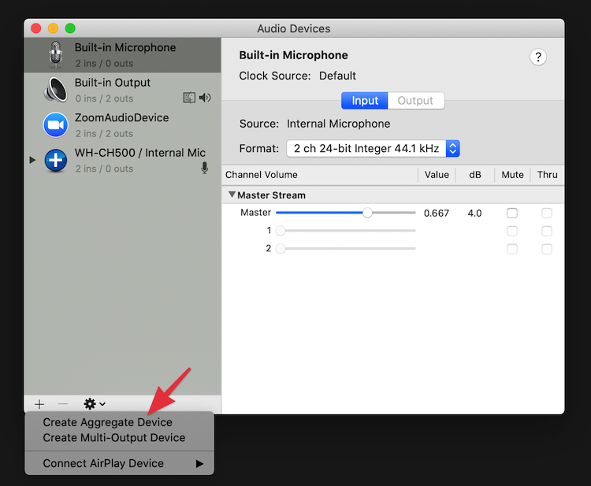
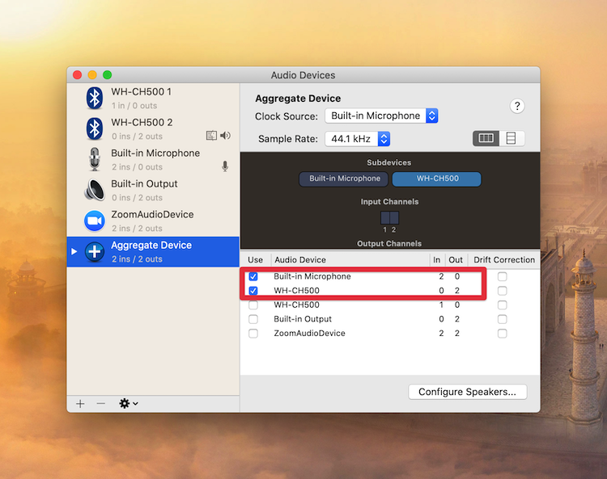

I have a [Sony WH-CH500](https://www.sony.com/electronics/headband-headphones/wh-ch500) Wireless Bluetooth headset I use for conference calls with Google Meet, Slack, and Zoom.  It's an inexpensive, no frills, headset and has worked great for me.

The one problem I had when I upgraded to macOS Catalina was strange.  When I would connect this headset, it would automatically disconnect after about 20 seconds.  Additionally, when trying to use it in an app, I'd get the dreaded macOS spinning pinwheel.  Other headsets work fine but not this one.  And it definitely only started to happen after upgrading to Catalina.

I eventually noticed that if the app I was using was only playing music, the problem did not happen.  It only seemed to happen on apps that used the headset mic.  So, I changed the macOS mic input to the MBP Internal Microphone before starting an app that uses the mic.  It stopped disconnecting.  Strange.  But, that's progress.

Great, so now I have figured how to get them to work without disconnecting.  But, each time I connect the headset, it defaults to using it for the headset mic and out the speakers so I'm left to change the mic input to the MBP Internal Microphone each time I connect.  That is a major problem and not realistic long-term.

Digging around online, I learned that you can create an "Aggregate Audio Device" on macOS to specify special config for your mic and speakers.  I figured I might be able to create one of these that would use the headset for output but the MBP Internal Microphone.

It actually worked!  Here's how I set it up.

1. Open the "Audio MIDI Setup" app in macOS
2. Click the **+** button the buttom left, and click "Create Aggregate Device".  
3. Select "Built-in Microphone and the "WH-CH500" device that shows 2 "Out" channels.  Leave the one with 1 In channels unchecked. .
4.  Select this new "Aggregate Device" as the primary Sound output and input device in Sound Settings.  Now, macOS will use the headset for output but the built-in microphone for input.

Now when I connect this headset, macOS remembers my "Aggregate Device" selection and will automatically select it.  When I use apps that require the mic, the headset no longer disconnects.

I really hope newer versions of Catalina will fix this but in the meantime this workaround will work for me.

