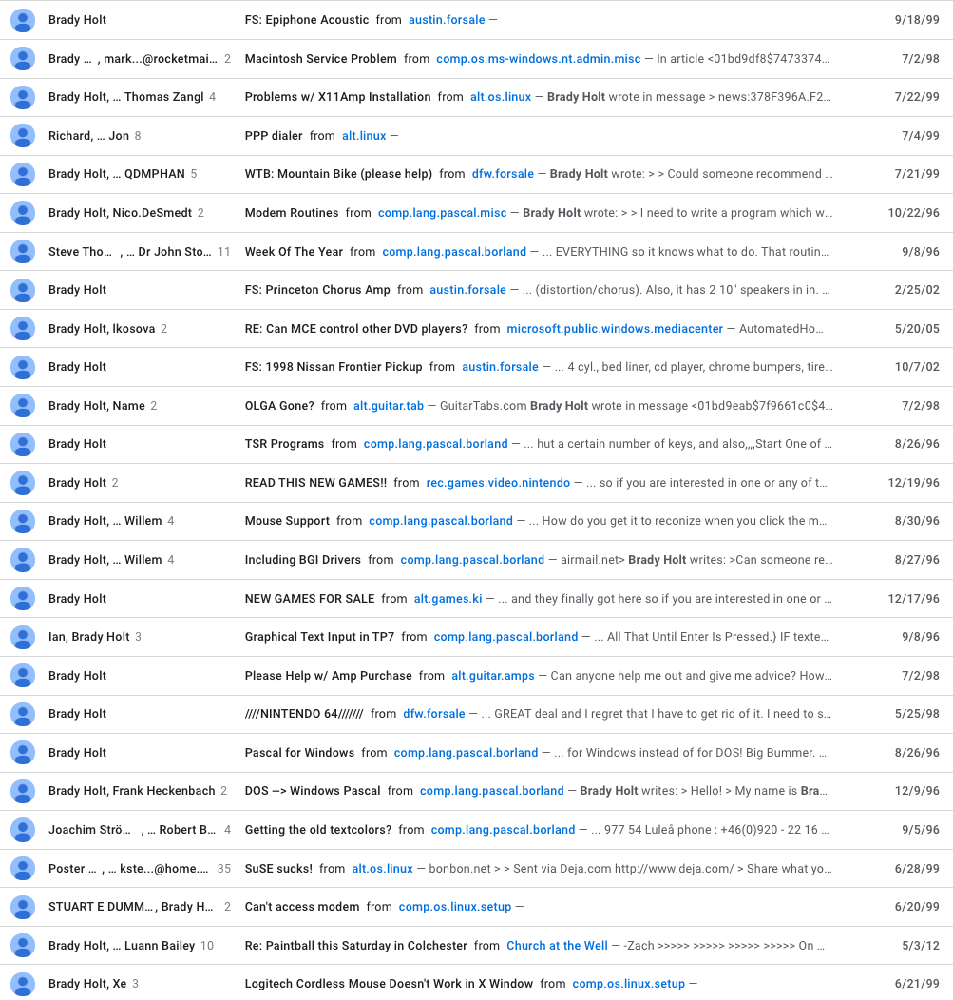
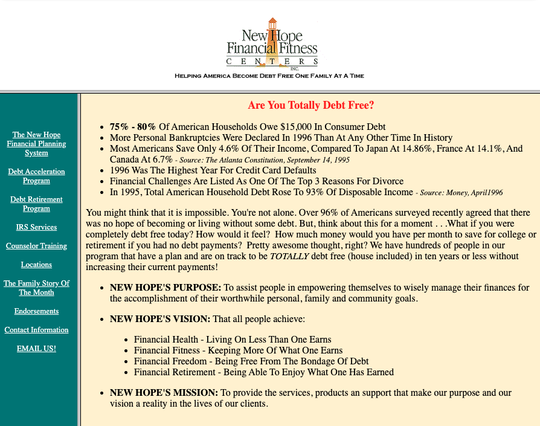

Every once in awhile I'll do some searching for things I posted online when I was younger.  It's fun to look back to my nascent technical days.  I've never chronicled any of this but thought I would do just that, here on my blog.

## Usenet

I got my first computer [when I was in 7th grade](https://www.geekytidbits.com/how-i-got-geeky-part-2/) and eventually got internet access through AOL and then a regular ISP.  A friend of my mine got me interested in Linux and programming in Turbo Pascal.  Also, he introduced me to [Usenet](https://en.wikipedia.org/wiki/Usenet), which I was thrilled about because it opened a door to talking to others about things I was interested in.

Here's a screenshot of my early posts:

My [first post on there](https://groups.google.com/g/comp.lang.pascal.borland/c/K8_jcecoBrk/m/yMfG1hs9P_QJ) was in `comp.lang.pascal.borland`, dated 08/26/1996.

<pre>
From: Brady Holt
To:   comp.lang.pascal.borland
Date: Aug 26, 1996, 3:46 PM

Is there any easy way to explain TSRs? I just want to write a TSR that
will delay characters when you type, THrow a message on the screen when
you hut a certain number of keys, and also,,,,Start One of My Screen
Savers when you hit a combination of Keys..
Can Anyone HElp?

Thanks,
Brady Holt
</pre>

A "TSR" was a "Terminate-Stay-Resident" Turbo Pascal program that could run in the backgorund. I was sixteen years old and eager to learn.

Some other ones I found:

- Defending SuSE Linix - https://groups.google.com/g/alt.os.linux/c/QYGqCnWMFkA/m/I9aawwRCnLEJ
- Installing Red Hat Linux 6.0 for first time and having trouble with modem - https://groups.google.com/g/comp.os.linux.setup/c/z0ylYXEetsI/m/kcsDQJ-OH_kJ
- Trying to work with graphics in Turbo Pascal - https://groups.google.com/g/comp.lang.pascal.borland/c/SAiF0V0dyUg/m/1QqrwZeIHLUJ
- Getting a little snooty about programming - https://groups.google.com/g/comp.lang.pascal.borland/c/52Ic3wY7ILw/m/xelD2lBc4isJ

## Wayback Machine

The [Wayback Machine](https://archive.org/web/) is a wonderful web archive that contains snapshots of webpages from various dates.  Not long after I was playing around with Turbo Pacal and posted on Usenet, I started building websites.

I have been unable to find my original website in the wayback machine, which is a shame because it would be really fun to see it again.

I found the [first website I wrote that I actually got paid for](https://web.archive.org/web/20010515223221/http://www.debtfree-newhope.org/).  It was for a debt credit counseling company owned by a friend of my Dad's.  I think the owner paid me $100.  The url was www.debtfree-newhope.org.

Another fun one I found was a [a webpage](https://web.archive.org/web/19991013235857/http://come.to/lrbc) I put up in 1999 for the church youth group I was in.  I also found the PointPoint presentation I put together announcing the website [here](https://drive.google.com/file/d/0B0QcY8zkcJPvOUg2S2NxNGNYRlE/view?usp=sharing).

Another thing I found was my Netscape Navigator bookmarks from 2001, when I was a Junior in college: https://web.archive.org/web/20010614074315/http://web2.airmail.net/jwholt/bookmarks.htm.  Wow, looking at those bookmarks is a blast from the past because it gives good glimpse into my school work and interests at the time.

## Code

Although technically not "posted" online at the time, I kept Turbo Pascal source code from my very early days of learning to programming.  I sure am glad I did because it's a blast to look back on it.  This is stuff I wrote when I was in 7th or 8th grade.  I have [posted it on GitHub](https://github.com/bradymholt/pascal-scratch) for ease of access.

The first program I ever got paid for was a screen saver for my boss' computer at Sparkle Car Wash.  Here's the source: https://github.com/bradymholt/pascal-scratch/blob/master/SPARKLE.PAS.  It would print the contents of `TEXT.TXT` ("Sparkle Car Wash!" was in there) to the screen in varying colors, changing positions on the screen every 2.5 seconds.  I remember clearly he paid me $20 and was thrilled about it.

Some other notable ones in the repository:

- My obligatory Tic-Tac-Toe program: https://github.com/bradymholt/pascal-scratch/blob/master/TICTAC.PAS.
- "The Magic 8 Ball" - https://github.com/bradymholt/pascal-scratch/blob/master/MAGIC8.PAS.  I remember this was the most significant program I had written at the time and was super proud of it.  I would show it to any family or friends who would lend their attention.
- My first TSR (background app) - https://github.com/bradymholt/pascal-scratch/blob/master/DELAYTSR.PAS

It's always fun looking back on things I was learning and making in those days.
