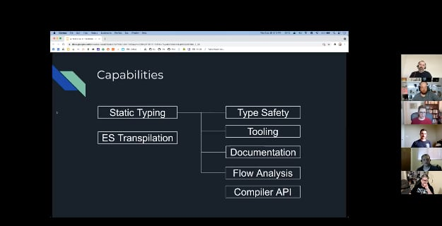

On Wednesday of this week, I had the opportunity to give a [tech talk](https://www.meetup.com/coloradospringsjs/events/jbpblpycchbjc/?comment_table_id=515041897&comment_table_name=event_comment) at [coloradoSrpings.js](https://www.meetup.com/coloradospringsjs), a Meetup in Colorado Springs, Colorado.

I recently moved to Colorado Springs and had been looking forward to meeting other developers and talking shop.  After attending my first meeting, I was somehow nominated to give the next talk.  I joked with them about "how things around here" for new people.

The name of the talk was "A Fresh Look at TypeScript" and I've given this talk previously in [Houston](https://www.geekytidbits.com/nodejs-houston-typescript/) and [Austin](https://www.geekytidbits.com/atx-nodejs-typescript-fresh-look/).  Of course I updated the information and added a few more demo examples to keep it fresh and updated.  It's a fun talk to give.

The slide deck can be found on [Google Slides](https://docs.google.com/presentation/d/19Mtz3DGW4k7uEwPmIlOuQwv9SBnyTPzThv1fSMXGuYU/edit?usp=sharing) and the example code repository can be found on [GitHub](https://github.com/bradymholt/cos-js-typescript/tree/main/examples).

