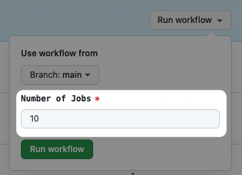
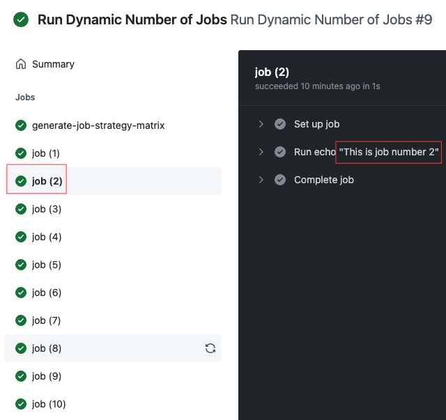

Recently I had the need to run a GitHub Action workflow job that would take well over the [6 hour execution time limit](https://docs.github.com/en/actions/learn-github-actions/usage-limits-billing-and-administration#usage-limits) and needed to figure out how to break it up into multiple jobs.  Out of that work emerged a
handy pattern for setting up a workflow with a variable number jobs, each of which can be executed serially or in parallel.

#### Workflow Pattern

```yaml
name: Run Dynamic Number of Jobs
on:
  workflow_dispatch:
    inputs:
      number_of_jobs:
        description: "Number of Jobs"
        required: true
        default: 10
jobs:
  generate-job-strategy-matrix:
    runs-on: ubuntu-latest
    outputs:
      job-strategy-matrix: ${{ steps.generate.outputs.job-strategy-matrix }}
    steps:
      - id: generate
        run: |
          JOB_STRATEGY_MATRIX=$(node -e "let r=[]; for(let i = 1; i <= process.env.NUMBER_OF_JOBS; i++) { r.push(i) }; console.log(JSON.stringify(r));")
          echo "::set-output name=job-strategy-matrix::$JOB_STRATEGY_MATRIX"
        env:
          NUMBER_OF_JOBS: ${{ github.event.inputs.number_of_jobs }}
  job:
    needs: generate-job-strategy-matrix
    runs-on: ubuntu-latest
    timeout-minutes: 360 # 6 hour timeout
    strategy:
      matrix:
        job: ${{ fromJson(needs.generate-job-strategy-matrix.outputs.job-strategy-matrix) }}
      max-parallel: 1 # Run jobs serially
      # max-parallel: ${{ github.event.inputs.number_of_jobs }} # Run jobs in parallel
    steps:
      - run: echo "This is job number ${{ matrix.job }}"
```

#### Explanation

The first job, `generate-job-strategy-matrix`, will run a simple script (using Node.js which is installed and available automatically) to generate an array string that looks like: `[1,2,3,4,5,6,7,8,9,10]`.

That string will be specified as an output named `job-strategy-matrix` so that it can be referenced by a subsequent job.

In the second defined job (named "job"), we will define a [strategy matrix](https://docs.github.com/en/actions/using-jobs/using-a-matrix-for-your-jobs) using the `job-strategy-matrix` output from the first job.  For strategy matrices, you usually define a static array like `[node-12, node-16]` but using `fromJson` you can define a [dynamic matrix](https://www.cynkra.com/blog/2020-12-23-dynamic-gha/).

Now, GitHub Actions will use `[1,2,3,4,5,6,7,8,9,10]` as the job matrix and run 10 jobs.  These jobs will be run _serially_ because of the `max-parallel: 1` config.  If you wanted to run all the jobs in parallel you change to `max-parallel: ${{ github.event.inputs.number_of_jobs }}`.

When you go to manually run this workflow, it will default to 10 jobs but you can change it.



When you run the workflow, it will execute 10 jobs and the job number will be available in the variable `${{ matrix.job }}`.


