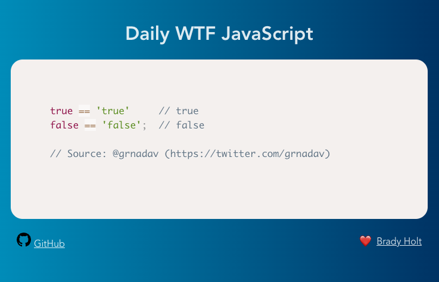

I have been itching to build something recently.  In the not so distant past when I've had this desire I ended up building a project template as a way to learn some new things and create a scaffold for a project I might tackle in the future.  But, this time I decided I want to build something that I could actually publish.

What I ended up building is silly and trivial but it was fun: [Daily WTF JavaScript](https://dailywtfjs.geekytidbits.com/) - a site that displays a daily rotating snippet of JavaScript that makes you say "WTF!".  Yes, there are no shortage of examples.

As always when building things, I learned plenty:
- [Vite](https://vitejs.dev/) - I used Vite as a build tool and wow was I impressed.  This felt so much better than using webpack or one of its derivatives.
- `place-items: center;` for centering an HTML element horizontally and vertically
- GitHub Actions with GitHub Pages - My [workflow](https://github.com/bradymholt/daily-wtf-js/blob/main/.github/workflows/gh-pages.yml) to publish the site to GitHub Pages uses GitHub Actions, which is the new generation method for working with pages.  I can now use this template as a baseline for other projects.
- Although I've used [jsdom](https://github.com/jsdom/jsdom) before, it's been awhile and I was able to reintroduce myself to its usefulness to parse HTML on the server side.
- I was exposed to the wonderful world of [CSS Gradient Swatches](https://cssgradient.io/swatches/).
- I learned more about [PostCSS](https://postcss.org/) and want to continue learning and using it further.
