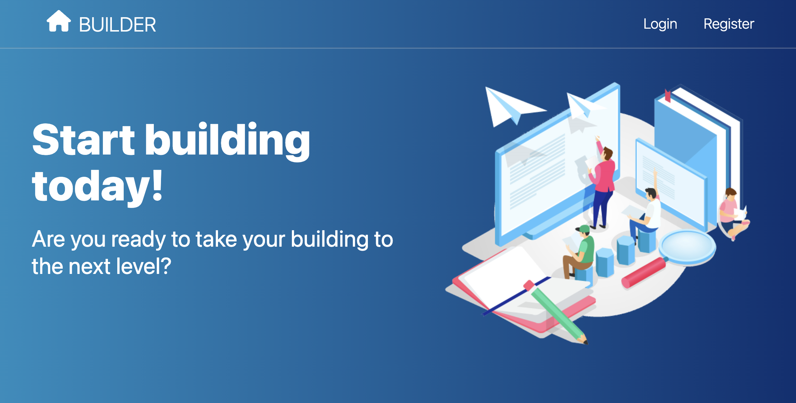

SvelteKit is a web framework I've been keeping my eye on. Sure, it builds upon Svelte, but there is a lot more to it. It uses [Vite](https://vitejs.dev/config/) for build tooling, has a simple file-based routing system, and allows you to build "Transitional Web Apps", as Rich Harris calls them in his [Have Single-Page Apps Ruined the Web?](https://www.youtube.com/watch?v=860d8usGC0o) talk from Jamstack Conf 2021. I think at first glace it looks like a great framework for building web apps.

Since it just hit [v1.0](https://svelte.dev/blog/announcing-sveltekit-1.0) I thought now would be a good time to play with it. I've also been learning more about Cloudflare Workers, Pages, KV, etc. and decided I would like to build a simple web app using SvelteKit and deploy it to Cloudflare Pages.

The result of my playing is simple app template that implements user authentication.  You can register a new user, login with a new registration, initiate a Forgot Password flow including sending a reset email.  You can see the GitHub repo here: [https://github.com/bradymholt/sveltekit-auth-template](https://github.com/bradymholt/sveltekit-auth-template) and the live site here: [https://sveltekit-auth-template.pages.dev/](https://sveltekit-auth-template.pages.dev/).

Things I learned and worked with while building this template:

- How to create JWTs on Cloudflare Workers
- How to use [KV](https://developers.cloudflare.com/workers/learning/how-kv-works/), Cloudflare's key value store
- Sending emails with [MailChannels](https://blog.cloudflare.com/sending-email-from-workers-with-mailchannels/)
- Validation with [zod](https://github.com/colinhacks/zod)
- TailwindCSS - although I initially used Tailwind I changed my mind and removed it.  But, I took it for a spin and learned a bit about it.
- Self-hosting web fonts
- PostCSS - I haven't done much with PostCSS before but I was able to play with it and in particular, use the "postcss-nested" plugin to get nested CSS working without having to use Sass or Less.
