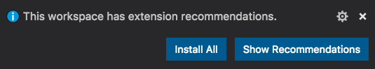

[Recommended extensions](https://code.visualstudio.com/docs/editor/extension-marketplace#_recommended-extensions) in VS Code are a useful way to keep a development team on the same page.  You can recommend extensions that perform formatting when saving files, show lint warning, and many other things that are useful when collaborating together on a codebase.

If extensions are recommended, VS Code users should see the following popup when opening the workspace folder:



There is a problem though: if a user dismisses this popup, it will not be shown again for the workspace.  Also, if they have `extensions.ignoreRecommendations` set to `true`, they will never see this popup in the first place.

I found a way to install them automatically when opening a workspace folder in VS Code.  With a `"runOn": "folderOpen"` VS Code task, we can run some code when the workspace is opened.  Using a shell script, we can parse the `extensions.json` file and then run `code --install-extension` for each extension to install it.

In `.vscode/tasks.json`, you can create the install tasks like this:

```json
{
  "version": "2.0.0",
  "tasks": [
    {
      "label": "Install All Recommended Extensions",
      "type": "shell",
      "windows": {
        "command": "echo 'Not Supported on Windows'"
      },
      "command": "node -e \"console.log(JSON.parse(require('fs').readFileSync('./.vscode/extensions.json')).recommendations.join('\\n'))\" | xargs -L 1 code --install-extension",
      "runOptions": {
        "runOn": "folderOpen"
      },
      "presentation": {
        "reveal": "silent"
      }
    }
  ]
}
```

Note: The task assumes `node` (Node.js) and `code` CLI commands are available.  Instructions for installing the VS Code CLI `code` can be found [here](https://code.visualstudio.com/docs/editor/command-line).


With that task in place, extensions will be installed automatically!  It looks like this when you open the workspace folder in VS Code:
<video width="700" controls="controls" autoplay muted loop>
  <source src="extension-recommendations.mp4" type="video/mp4">
</video>


