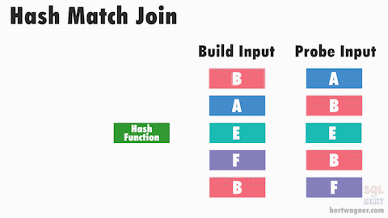

When you write a SQL query that joins two or more tables, PostgreSQL has to decide how to execute that join. The strategy it chooses can have a big impact on performance. Understanding the different join strategies can help you write more efficient queries and optimize your database.

Let's take an example. We have two tables: `users` and `posts`. We want to find all posts made by a user with the username 'alice'.

```sql
EXPLAIN
SELECT p.id
FROM posts p INNER JOIN users u ON u.id = p.user_id
WHERE u.username = 'alice';
                                          QUERY PLAN
----------------------------------------------------------------------------------------------
 Hash Join  (cost=8.17..20.21 rows=1 width=4)
   Hash Cond: (p.user_id = u.id)
   ->  Seq Scan on posts p  (cost=0.00..11.60 rows=160 width=8)
   ->  Hash  (cost=8.16..8.16 rows=1 width=4)
         ->  Index Scan using users_username_key on users u  (cost=0.14..8.16 rows=1 width=4)
               Index Cond: ((username)::text = 'alice'::text)

```

In the example above, PostgreSQL has chosen to use a Hash Join strategy.  Why did it choose this strategy?  How does that strategy work?  Is it the best choice for this query and if not is there something I can do to help it choose a better strategy?

Let's explore the three main join strategies PostgreSQL uses: Nested Loop Join, Hash Map Join, and Merge Join.

## Nested Loop Join

The Nested Loop join is the simplest and most intuitive join strategy. It works by iterating over each row in the outer table and for each row, it looks up matching rows in the inner table. If there is an index on the join column of the inner table, it can use that index to speed up the lookups.  You can think of it like a double for-loop in programming.  It is a good choice when the outer table is small or very selective, and/or the inner table has a good index on the join column.  In fact, it can be the very fastest strategy when the outer table is small and there is a hash index on the inner table. However, if both tables are large and there are no helpful indexes, this strategy can be very slow.  Interesting side-note: This is the ‘default’ strategy when others cannot or will not be be used in PostgreSQL.

### Time Complexity

- Typical: `O(m * log n)` (B-tree index)
- Worst case: `O(m × n)` (no indexes)
- Best case: `O(m)` (hash index)

### Visualization


### Performance Tips

To ensure a Nested Loop join is as efficient as possible:

- Increase selectivity on the outer table side
- Ensure inner table join column is indexed properly
- Select only columns within indexes
- Use INCLUDE in index to allow index-only scans

## Hash Map Join

The Hash Map join strategy works by building a hash table in memory for one of the input tables (usually the smaller one) based on the join key. Then, it scans the other input table and for each row, it "probes" the hash table to find matching rows. This strategy is very efficient for large, unsorted tables and can handle large datasets well, as long as there is enough memory to hold the hash table. However, if the hash table is too large to fit in memory, PostgreSQL may need to write it to disk (called a 'spill'), which can slow down performance. It is a very flexible strategy and can be thought of as a workhorse as it is often used in practice.

The Hash Map join requires an equality condition (e.g., `ON a.id = b.a_id`) and is not suitable for non-equality joins.

### Time Complexity

- Best case: `O(m + n)`
- Worst case: `O(m × n)` (when many hash collisions occur and/or when 'spilling' to disk because there is not enough `work_mem` to hold the hash table)

### Visualization



### Performance Tips

To ensure a Hash Map join is as efficient as possible:

- Reduce row width (select fewer columns) to prevent disk ‘spills’
- Filter more data early to reduce burden of hashing step
    - Expand WHERE clause
    - Add another join condition
    - Use a sub-query or CTE (Common Table Expression)

## Merge Join

The Merge Join strategy works by first sorting both input tables on the join key, and then merging them together in a single pass. This strategy is very efficient when both input tables are already sorted on the join key, or when sorting is needed for other reasons (e.g., an `ORDER BY` clause).  B-tree indexes are inherently sorted and can be leveraged to avoid the sorting step. However, if the input tables are large and unsorted, the sorting step can be expensive and may make this strategy less efficient than others. It is often the preferred strategy when conditions are right.

### Time Complexity

- Best case: `O(m + n)` (if both inputs are already sorted or sorted B-tree indexes can be used)
- Worst case: `O(m log m + n log n)` (both inputs need to be sorted first)

### Visualization


### Performance Tips

To ensure a Merge Join is as efficient as possible:

- Prefer B-tree indexes (vs. hash index) to ensure they are sorted
- Reduce row width (select fewer columns)
- Select only columns within indexes
- Match collation & data types on both sides to keep scans orderable
- Use multi-column indexes in same order as join conditions

## General Tips

Postgres choses a join strategy based on various factors including table sizes, available indexes, data distribution, query structure, and more.  To ensure you are giving Postgres the best chance to choose the most efficient join strategy, consider the following general tips.

### Ensure table statistics are accurate

Make sure your table statistics are up-to-date so the query planner can make informed decisions about join strategies.  You can manually run `ANALYZE` on your tables and/or ensure autovacuum is running properly to keep statistics current.  Statistics play a big role in the query planner's decision on join strategy!

### Index available on join column(s)

This one is probably obvious but it is worth mentioning.  Having an index on the join column(s) can significantly speed up join operations, especially on the "inner input" side when Nested Loop join is being used.

### Strive for simple equality join conditions

If possible, use simple equality conditions in your join clauses (ON a.id = b.a_id) and avoid operations such as `<, <=, >, >=, !=, LIKE` .  Complex expressions or functions can prevent the use of the Hash Map join strategy where it might otherwise be the best choice.

### Avoid functions/casts on join conditions

Using functions or type casts on join conditions can prevent the use of indexes and lead to less efficient join strategies.  If you must use a function or cast, consider creating a generated column that pre-computes the value and indexing that column.

### Use multi-column indexes in same order as join conditions

If your join condition involves multiple columns, consider creating a multi-column index that matches the order of the columns in the join condition.  This can help the query planner choose a more efficient join strategy.

### Be careful with `SELECT` columns

Selecting only the columns you need and/or are included in indexes can impact performance more than you might expect.  This is especially true when using the Hash Map join strategy where reducing row width can help prevent 'spilling' to disk.  Also, if you select only columns that are included in an index, Postgres can use an index-only scan which can be significantly faster than a regular scan.

### Perturbing the Join Strategy

If your query is still slow even after ensuring you are giving Postgres everything possible to chose the most efficient join strategy, you can perturb the join strategy by disabling certain strategies (for the current session) using the following commands:

```sql
SET enable_hashjoin = off;
SET enable_mergejoin = off;
SET enable_nestloop = off;
```

By inspecting the `EXPLAIN` output after disabling specific strategies, you can see how the query planner's choice changes and what factors are impacting its decision to choose a particular join strategy.  This can help you identify potential optimizations for your query.
