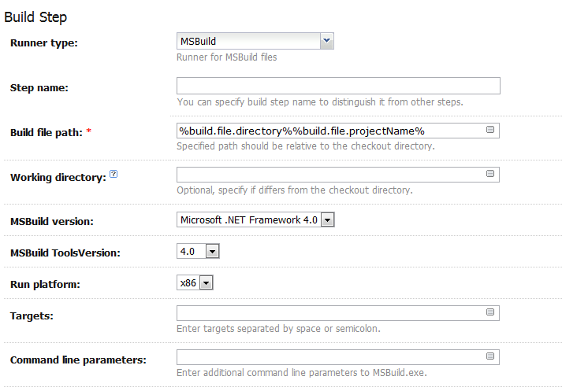

  I use <a href="http://www.jetbrains.com/teamcity/" target="_blank">TeamCity</a> as a <a href="http://martinfowler.com/articles/continuousIntegration.html" target="_blank">continuous integration</a> server but also as a build/deploy server. With the click of a button, TeamCity will build my solution, run unit tests and automatically deploy my web application to a server. This is awesome because:

  <ol>
    <li>
      It <strong>saves tons of time </strong>as it automates the process.
    </li>
    <li>
      It ensures the <strong>integrity of the build</strong> before deploying (compile, run tests, halt if error).
    </li>
    <li>
      It allows me to <strong>encapsulate deployment logic</strong> so that there are no manual, &#8220;magic&#8221; steps involved with deployment. When I go on vacation, another developer can deploy my app with the same button click I use.
    </li>
  </ol>

  I could go on and on about the advantages of using a CI/build/deploy server for development but here I want to explain how to setup TeamCity to use the new Web Deploy (MS Deploy) tool to <strong>deploy ASP.NET Web Application projects</strong> to a <strong>server running IIS</strong>.

## Setup Steps

1. Install the [Web Deployment Tool](http://www.iis.net/download/webdeploy) on your TeamCity server and the server you want to deploy your web application to (&#8220;target server&#8221;).
2. On your target server, setup an administrator user account for use by TeamCity.
3. Create a new project in TeamCity.
4. Under Project Configuration, select &#8220;Build Parameters&#8221; option.
5. Add Configuration Parameters and System Properties per the example below. 
6. Change the values highlighted in yellow above to your own values. A few notes:
   - **build.file.directory** = this is the *relative checkout path *of the folder which contains your web application .csproj file
   - **system.DeployIISAppPath** = the IIS website name on the target server which you want to deploy to. Yes, this means you need to configure IIS ahead of time if you are going to use anything other than the &#8220;Default Web Site&#8221; in IIS.
   - **system.MsDeployServiceUrl** = the server name or IP address of the target server.
   - **system.UserName / system.Password** = the username and password of the administrator account you setup earlier for the target server.
7. Under Project Configuration, select &#8220;Build Steps&#8221; option and add a new Build Step (MSBuild runner type).
8. Configure the new build step per the example below:
   
9. Save the new TeamCity project.
10. Run the project build and you&#8217;re done! The web application will be compiled and deployed to your server running IIS.

### Next Steps

- Utilize <a href="http://msdn.microsoft.com/en-us/library/dd465318.aspx" target="_blank">Web.config Transformations</a> so that your web.config file can be automatically changed to environment specific setting at deployment time.
- Add a TeamCity build step to your project to run your unit tests before the MsBuild step.
- Read up on the <a href="http://learn.iis.net/page.aspx/516/configure-the-web-deployment-handler/" target="_blank">Web Deployment Handler</a> and fine tune it to your needs.
- Use &#8220;IIS Manager&#8221; permission to avoid having to use an administrator account on the target server.

### Credit and Reference

- <a href="http://weblogs.asp.net/scottgu/archive/2010/09/13/automating-deployment-with-microsoft-web-deploy.aspx" target="_blank">Automating Deployment with Microsoft Web Deploy</a>
- <a href="http://www.troyhunt.com/2010/11/you-deploying-it-wrong-teamcity_25.html" target="_blank">You&#8217;re deploying it wrong! TeamCity, Subversion & Web Deploy part 4: Continuous builds with TeamCity</a>
