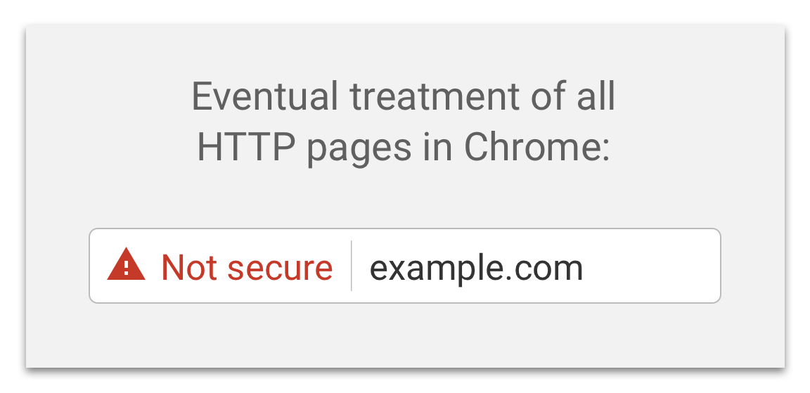
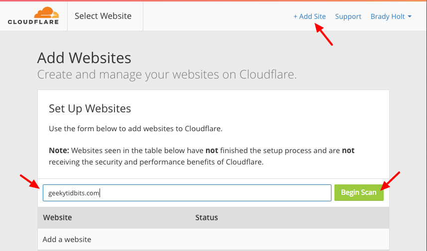
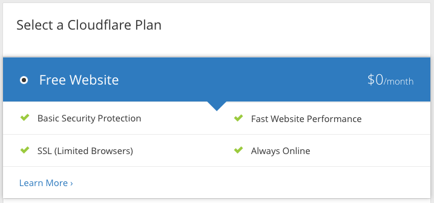

HTTPS everywhere!  This is the trend of late, and for good reason.  Phishing, connection snooping, man-in-the-middle attacks and hacking in general is pervasive today and security on the web is more important than ever.

I think Google played a bit part in this push, starting with their 2014 [HTTP as a ranking signal](https://webmasters.googleblog.com/2014/08/https-as-ranking-signal.html) post where they announced they would start taking SSL into account in their search rankings.  Although it's weighted only a small amount, in that post they left open the possibility for a heavier weighting in the future.  Then, they put some money behind this call to action by helping to fund [Let's Encrypt](https://letsencrypt.org/), a non-profit certificate authority giving away free SSL certificates.  Finally, in 2016 their [Moving towards a more secure web](https://security.googleblog.com/2016/09/moving-towards-more-secure-web.html) post really struck some fear in site owners everywhere with the announcement they they will eventually start showing regular HTTP connections like this:

That is a pretty strong imperative to get HTTPS on your site, ASAP.  Regardless of how you feel about the need for HTTPS on your simple blog site, the fact that Chrome users (FireFox, Edge and others will surely follow suit) will see this warning on your site is downright jolting.

The good news is, it's easier and cheaper (free!) than ever to get HTTPS setup on your site.  To get my blog running on HTTPS, I decided to use Cloudflare which makes it trival.  Let's walk through the setup.

### Initial Setup

* Signup for a Cloudflare account at [https://www.cloudflare.com/a/sign-up](https://www.cloudflare.com/a/sign-up).
*  Click "Add Site" at the top, enter your domain name, and click "Begin Scan".

*   Once the scan is done, click "Continue Setup", and review your DNS records.  Most likely, you can leave these as is.  Cloudflare defaults your DNS records based on the current setup at your existing nameserver.  Once you've reviewed, click "Continue".

*  Choose the "Free Website" plan.  Free is nice.

*  Follow the instructions to change your domain nameserver to Cloudflare.

*  Click "Continue" and continue to the "Overview" screen. 

* Your Domain Summary should show SSL: Flexible.

### HTTPS Rewrites

Even if you serve your site over HTTPS, if you have resources or links pointing to non-secure HTTP URLs, browsers will display a mixed-content security warning which you want to avoid.  Ideally, you can update these references in your site itself (and do so going forward) but there is a setting in Cloudflare called "Automatic HTTPS Rewrites" we will use that is a nice stop-gap solution for existing references or ones you missed.

*  At the top of the screen, click the Crypto icon 

* Scroll down to the bottom and toggle "Automatic HTTPS Rewrites" On.

### Forcing HTTPS

Finally, we'll create a Page Rule to force HTTPS on the site.  This means thet anyone accessing the http:// scheme for your site will be redirected to the https:// scheme.

* Click on the "Page Rules" icon at the top of the site 

*  Click "Create Page Rule", specify http://*[youdomainhere.com]/* in the "If the URL matches" textbox and select "Always Use HTTPS" for the setting.

### Done!

Now, all you need to do is wait for the nameserver changes to propagate which can take up to 24 hours.  Once this process is complete, your site is setup with HTTPS.

That was easy.
