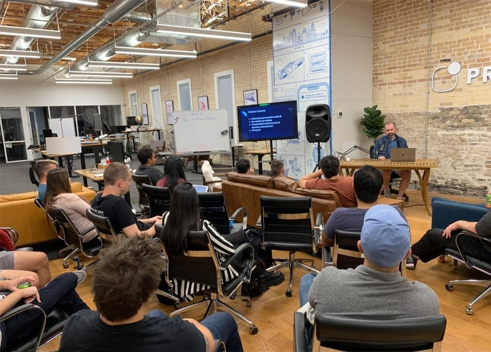

Last week I presented at the [Austin Node.js Meetup](https://www.meetup.com/austinnodejs/).  The topic was "A Fresh Look at TypeScript" and the pitch was:

> You’ve been seeing more and more about TypeScript lately but you might not have given it a serious try. We’ll take a fresh look at this strongly-typed, JavaScript superset and see what all the hype is really about and whether TypeScript makes sense for your next project. We’ll talk about the advantages it brings along with demonstrating some of the more interesting features it has to offer. We'll talk about developer tooling and ESNext support along with language features including generics, nullable types, type guards, and mapped types. Whether you've never tried TypeScript before or have used it some, this talk should give you a better sense of what TypeScript has to offer and help you make an informed decision about using it.

I gave a talk with the same title a couple of years ago at the [Houston Node.js Meetup](/nodejs-houston-typescript/) but updated my slides and examples to account for the last 2 years.  Quite a bit has changed and it was interesting looking back on what I presented then.

Here is the presentation:

<iframe src="https://docs.google.com/presentation/d/e/2PACX-1vSQTByx8rZEduysc4LiEh5tsQKa7Ow55hdD2BF_e67Va9IS1AhYggnnAUvgT3kvywmnHIN1CtbKIqk_/embed?start=false&loop=false&delayms=3000" frameborder="0" width="960" height="569" allowfullscreen="true" mozallowfullscreen="true" webkitallowfullscreen="true"></iframe>

Here is the repository containing the examples I walked through during the demo portion of the presentation:
[https://github.com/bradymholt/atx-node-typescript](https://github.com/bradymholt/atx-node-typescript)

This was a great experience to share some of what I've learned (about TypeScript), practice presenting in front of other developers and make connections in the community!
