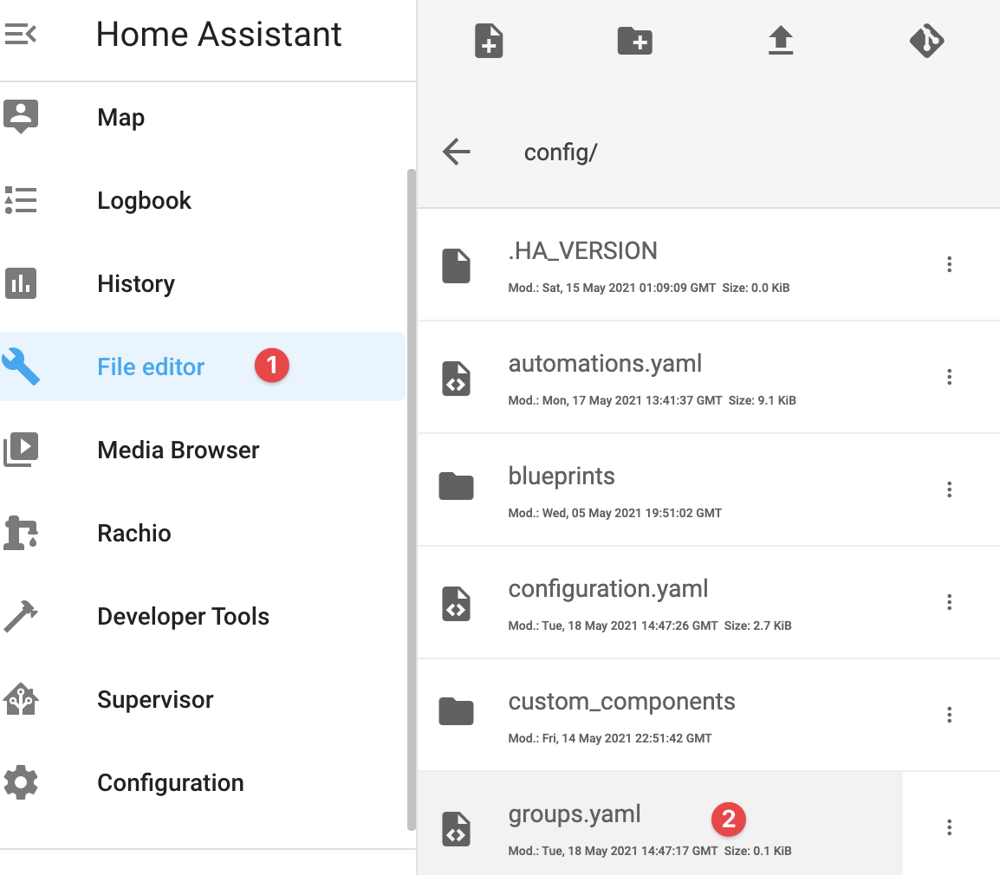
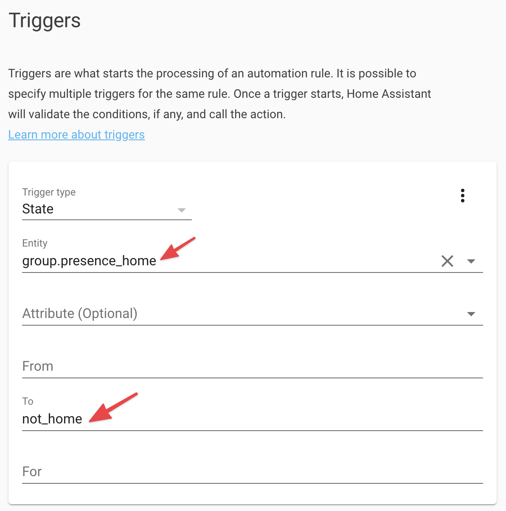
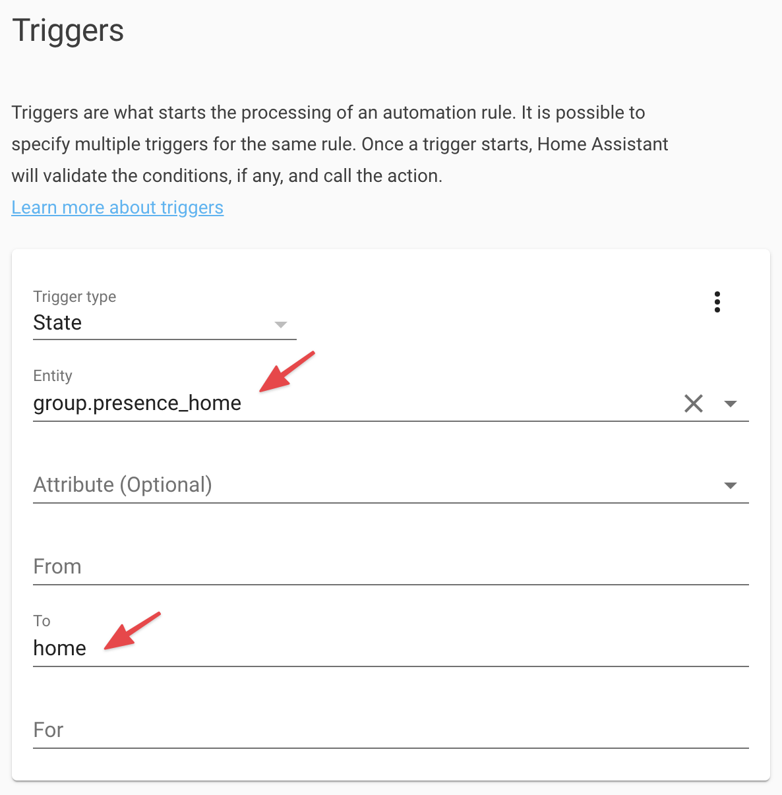

I moved to a new house a few months back and had the opportunity for a greenfield home automation project.   I eventually found [Home Assistant](https://www.home-assistant.io/) and it wasn't long before I was hooked.

One of the things that wasn't clear when setting up Home Assistant Presence Detection was how to tie multiple devices or people together.  It was easy to trigger off a device being 'Away' or 'Home' but not clear how to detect when multiple devices were 'Away' or any device was previously 'Away' and now 'Home'.  My use case is simple: Me and my wife have the Home Assistant app installed on our phones and I want to use those two phones to know if we are Home or Away.  This is trivial in SmartThings, which I previously used, and it surprised me this wasn't a first-class feature in Home Assistant.

Searching around I finally found a fairly straightforward way to achieve this, using 'Groups'.  Interestingly, there is not a UI for Groups so you have to configure them using .yaml.

Here are the steps to create a Group for Presence Detection.

1. Go to Supervisor => Add-on Store.  Search for "File editor" and install it.
    
1. Open the File editor from the Sidebar.  Click on the Folder icon  and select the `groups.yaml` file.

    
1. Use the following yaml format to define a new group.  In this example, the entity ID of my group is "presence_home", it's display name is "Presence Home" and is comprised of 2 persons: brady and katie (You can reference the users in Home Assistant by going to Configuration => People).  Save the changes to `groups.yaml`.

    

1. Restart Home Assistant so the configuration change will be picked up.  Go to Configuration => Server Controls => Server management and click "Restart".
1. Now you can use this group in an automation by setting up a "State" trigger, and specifying the group entity.  To trigger when _all_ people in the group are no longer home you can set it up like this:

    

   To trigger when _any_ person in the group was not home but is now home, you can simply change the "To" field to `home` rather than `not_home`:

   
