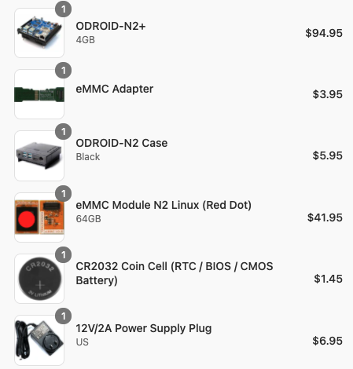
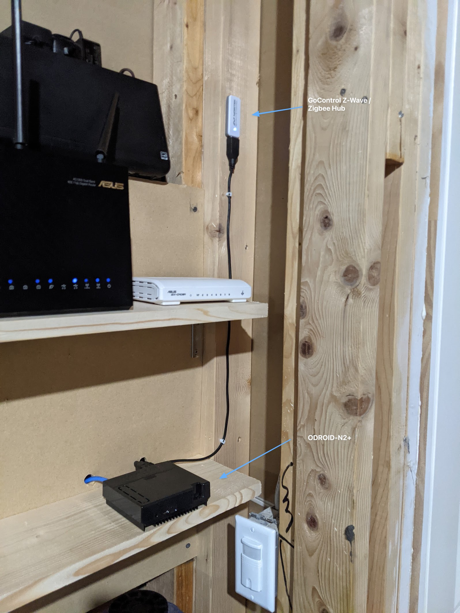

I have been having a lot of fun playing with [Home Assistant](https://www.home-assistant.io/) (HA) as part of getting my new house setup with smart automation.  I recently switched from using a Raspberry Pi 4 to an ODRIOD-N2+ because I was having stability issues.

### First Generation
I first installed HA on a Raspberry Pi 4, using a cheap SD Card from Micro Center.  It wasn't long before the SD card failed and I learned about how write heavy HA is and the need to use a high quality SD Card or SSD.  I switched over to a SSD and things got better.  But, once I upgraded past Home Assistant OS 5.2 my system become unstable and would freeze up weekly and sometimes only 24 hours after a reboot.  But, I was fairly invested in using it and determined to figure out the cause.  I tried all sorts of things and following a [GitHub issue](https://github.com/home-assistant/operating-system/issues/1119#issuecomment-919088077) tracking the problem.  Unfortunately the problem is still occurring (as of the date of this post) and seems to be specific to Raspberry Pi usage.

### Next Generation

Looking for advice on the [Home Assistant Community forum](https://community.home-assistant.io/) about the best HA setup, I decided to ditch my Raspberry Pi setup and go with an ODROID-N2+.  This is the same computer used in the [Home Assistant Blue](https://www.home-assistant.io/blue/) system, which is an all-in-one hardware and software package sold by the company behind HA.  I didn't want to spend the money but decided it would be worth it to have a solid, stable setup.  I placed
my order on [ameriDroid](https://ameridroid.com) and it included the following:

The order was $170.56 and arrived to my house in about 4 business days.

I installed Home Assistant OS on the eMMC card and booted it up.  I then restored a snapshot from my Raspberry Pi based system and to my relief, everything came right up.  It restored _everything_, as if I was still using my old system.  The HA snapshot backup / restore feature is really quite impressive and very useful.  In fact, it even recognized
and configured my  [GoControl CECOMINOD016164 HUSBZB-1 USB Hub](https://www.amazon.com/gp/product/B01GJ826F8/ref=ppx_yo_dt_b_search_asin_title?ie=UTF8&psc=1) (used for Z-Wave and Zigbee) without me having to change anything.  Wow, I was impressed.

I plugged everything in and mounted it in my tech closet:

The system has been running for over a month with no issues.  I am very glad I decided to switch over to the ODRIOD.
