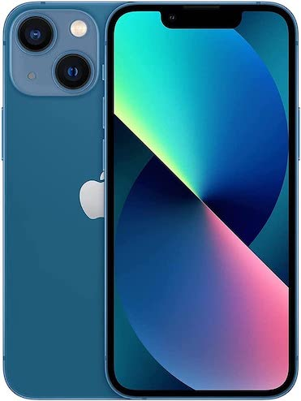

For the past 10 years I've been an Android user.  And, I've exclusively had Google phones, starting with the [Nexus 5](https://en.wikipedia.org/wiki/Nexus_5) and most recently the [Pixel 3](https://en.wikipedia.org/wiki/Pixel_3).  Before that, I had an [iPhone 4](https://en.wikipedia.org/wiki/IPhone_4).  But, I just switched back and now have a shiny new iPhone 13 mini.

  

So why did I switch?  It came down to 3 reasons:
1. The size.  I like the smaller size and I can't find a new, flagship Android phone in this size.
2. The app quality.  I like the Android operating system and think Google has really refined it.  But, the quality of the Google Play store apps are, in general, not as good as their iPhone counterparts.  It's sad but I think it's undeniably true.
3. I wanted to try something new.  `¯\_(ツ)_/¯`

### Things I Like
- Using the Google ecosystem (apps, services) on the iPhone is very feasible.  One of my biggest hesitations in switching to iOS was the ease of continuing use of the Google ecosystem and I was not disappointed.  The only annoyance I've found in this area is that iOS defaults opening address and web links in Apple Maps and Safari.  But, it's not as obtrusive as I expected.
- The quality of the apps.  This was one of the reasons I switched and after using a few of my favorite apps I see a noticeable quality difference.  It's obvious many companies prioritize the quality of their iOS apps.  Some examples: 1Password, Tablo TV, Zillow.  In particular, the experience using 1Password on iOS is significantly better (reliable and seamless autofill, Face ID speed) than Android and since I use it so often this is no small factor.
- The Shortcuts app - I'm a sucker for automation and [Shortcuts](https://apps.apple.com/us/app/shortcuts/id915249334) is a powerful, simple, and fun app.
- Widgets - I always enjoyed Android home screen widgets but in recent years it appears they have fallen out of interest of app developers.  iOS has widgets and they are very polished and useful.  The Weather and Google Calendar widgets are two of my favorites (so far...).
- The ability to enable "Do Not Disturb" mode "Until I Leave" a location.
- macOS interoperability:
  - Universal Clipboard - I love being able to copy text on my MacBook and paste it on my iPhone (and vise-versa)! This is very useful.
  - Calls and Messages - it is very convenient to be able to make / receive phone calls and send / receive messages on my Mac without having to pick up my phone, while sitting at my desk.  Granted, Google has "Messages for Web" that allows you to send / receive messages from a web app but this is only for messages and its _pairing_ mechanism is finicky sometimes.

### Things I Don't Like
- Voice Dictation - Voice Dictation on iOS is not up to par with Android.  Android's voice dictation is much faster and more accurate.  I have come to rely upon it heavily, especially for texting.
- Google Chrome interface - I don't like the interface Chrome has on iOS.  Undoubtedly, Google is trying to make its interface more iOS-like, but I prefer the layout on Android with tabs and navigation buttons on the top.
- Physical button location - Maybe it's because I'm left handed but I very much prefer to have the power button on the left side of the phone and the volume buttons on the right side and on the iPhone 13, it is exactly the opposite of this.
- Lightening adapter - Ugh, need I say more?  I had to buy a bunch of adapters which was not fun.
- The inability to schedule text messages - I love this feature on Android and it simply doesn't exist on iOS.

With all things considered, I am very happy and glad I made the switch!
